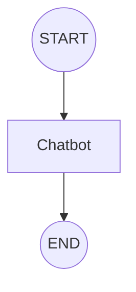
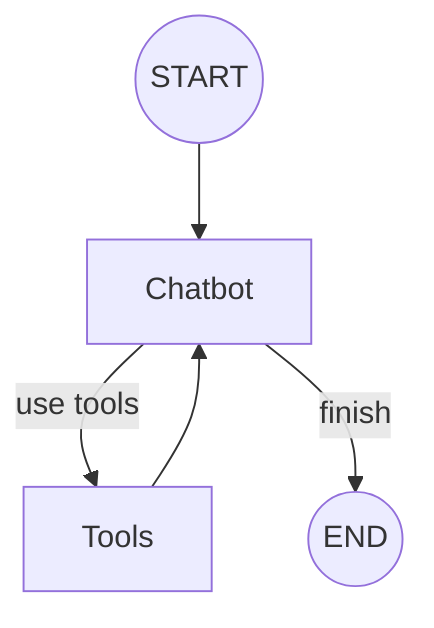

# Agentic Chatbot with Tools

A powerful and flexible chatbot application built using **LangGraph**, **LangChain**, and **Streamlit**. This project demonstrates how to create agentic workflows with LLMs (Groq, OpenAI, Gemini) and integrate tools like **Tavily Web Search**.

## 🚀 Features

- **Multi-Model Support**: Choose between Groq, OpenAI, and Gemini.
- **Agentic Workflows**: Powered by LangGraph for stateful, multi-turn interactions.
- **Dynamic Tool Integration**: Supports real-time web search via Tavily.
- **Streamlit UI**: Intuitive interface for configuration and chatting.
- **Traceable Execution**: Distinguishes between LLM thoughts and Tool outputs in the UI.

## 🏗️ Architecture

The application uses **LangGraph** to define the chatbot's logic as a state machine.

### 1. Basic Chatbot Workflow
A simple linear graph where the user input is processed by the LLM and the response is returned.



### 2. Chatbot with Web Search Workflow
An agentic graph that can decide to use tools (like web search) based on the user's query.



## 🛠️ Components

- **Nodes**:
  - `Chatbot`: Handles LLM invocation.
  - `Tools`: Executes tool calls (e.g., Tavily Search).
- **State**:
  - `Chatbot_state`: Manages the message history using `Annotated[List, add_messages]`.
- **Tools**:
  - `TavilySearch`: Provides web search capabilities.

## 🚦 Getting Started

### Prerequisites
- Python 3.10+
- API Keys for:
  - Groq, OpenAI, or Gemini
  - [Tavily](https://tavily.com/) (for web search)

### Installation
1. Clone the repository.
2. Install dependencies:
   ```bash
   pip install -r requirements.txt
   ```
3. Run the application:
   ```bash
   streamlit run app.py
   ```

## 📁 Project Structure

```text
Agentic_Chatbot_Tools/
├── src/
│   ├── ui/                 # Streamlit UI components
│   ├── workflow/           # LangGraph logic
│   │   ├── graphs/         # Graph definitions
│   │   ├── nodes/          # Graph nodes
│   │   ├── states/         # Graph states
│   │   └── tools/          # Tool definitions
│   └── main.py             # App entry point
├── requirements.txt
└── README.md
```

## 🔧 UI Enhancements
The UI now clearly distinguishes between **LLM responses** and **Tool outputs**. Tool executions are marked with a 🔧 icon, allowing you to see the "hidden" work the agent does before giving you a final answer.